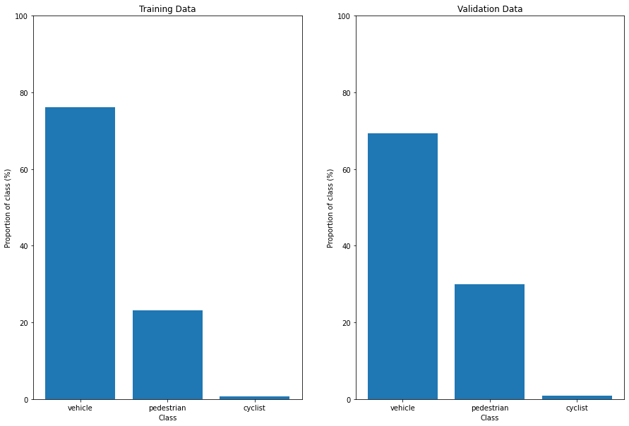
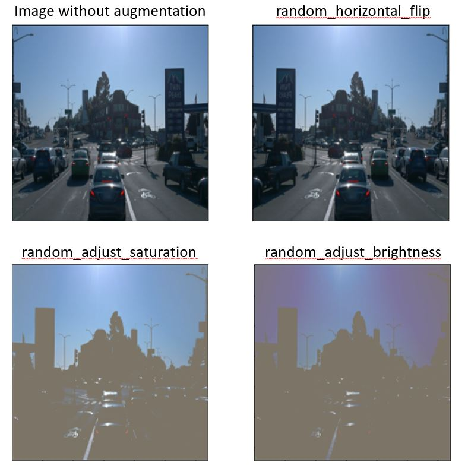

# Object-Detection-in-an-Urban-Environment
Udacity final project on Tensorflow Object Detection API of Waymo dataset

## Project Overview
The project is intended to train a Convolutional Neural Network model that can detect objects from the camera images on cars. This is useful for the case of self-driving cars, which need to detect and classify the objects, such as cyclists, pedestrians, and vehicles. The images is obtained from Waymo dataset, and use TensorFlow and Object Detection API to create the pipeline and train the model. Exploratory data analysis was done to familiarize ourselves with the images and the possible challenges that might be faced during training. The project also utilizes transfer learning by using the SSD Resnet model, which serves as the reference, and improved upon with image augmentations and hyperparameters optimization.

## Set Up
**Data** : The project already contained the data from the [Waymo Open dataset](https://waymo.com/open/) or more specifically in the [Google Cloud Bucket](https://console.cloud.google.com/storage/browser/waymo_open_dataset_v_1_2_0_individual_files;tab=objects?pli=1&prefix=&forceOnObjectsSortingFiltering=false).

The data, which are already split and used for training, validation and testing is organized in the /home/workspace/data/ directory as follows:

    train: contain the training data
    val: contain the validation data
    test - contains 10 files to test your model and create inference videos.

Meanwhile, the ../experiments/ folder is organized as follow:

    pretrained_model
    reference - reference training with the unchanged config file
    exporter_main_v2.py - to create an inference model
    model_main_tf2.py - to launch training
    experiment0 - create a new folder for each experiment you run
    experiment1 - create a new folder for each experiment you run
    label_map.pbtxt
    
Exploratory data analysis and visualization of the augmentations are provided in the Jupyter notebooks.

### Instructions
#### Editing the config file

The Tf Object Detection API relies on config files, and to modify the model, we can go to the corresponding experiment folder and edit the 'pipeline_new.config' file. If a new experiment is desired, then run the following in the project directory :

python edit_config.py --train_dir /PATH_TO_PROJECT_DIRECTORY/data/train/ --eval_dir /PATH_TO_PROJECT_DIRECTORY/data/val/ --batch_size 2 --checkpoint /PATH_TO_PROJECT_DIRECTORY/experiments/pretrained_model/ssd_resnet50_v1_fpn_640x640_coco17_tpu-8/checkpoint/ckpt-0 --label_map /home/workspace/experiments/label_map.pbtxt

A new config file called pipeline_new.config will be created in the project directory. Move this file to the /PATH_TO_PROJECT_DIRECTORY/experiments/NEW_EXPERIMENT_FOLDER_NAME/ directory.

#### Launching the training
In the project directory, run the following :

    python experiments/model_main_tf2.py --model_dir=experiments/NEW_EXPERIMENT_FOLDER_NAME/ --pipeline_config_path=experiments/NEW_EXPERIMENT_FOLDER_NAME/pipeline_new.config

To monitor the training, you can launch a tensorboard instance by running 
    
    python -m tensorboard.main --logdir experiments/NEW_EXPERIMENT_FOLDER_NAME/ 
    
Once the training is finished, launch the evaluation process. Launching evaluation process in parallel with training process will lead to OOM error in the workspace.

    python experiments/model_main_tf2.py --model_dir=experiments/NEW_EXPERIMENT_FOLDER_NAME/ --pipeline_config_path=experiments/NEW_EXPERIMENT_FOLDER_NAME/pipeline_new.config --checkpoint_dir=experiments/NEW_EXPERIMENT_FOLDER_NAME/

By default, the evaluation script runs for only one epoch. Therefore, the eval logs in Tensorboard will look like a blue dot.

## Dataset
The dataset contains images of vehicles, pedestrians, and cyclists. The class distribution of the annonated objects are displayed below :

Distribution of classes in training data

It can be observed that the distribution is imbalanced since cars are detected more in the dataset and it is possible that the model would perform poorly when detecting the other classes due to the lack of training on these objects.

Most of the images are also taken during daylight, where the brightness is quite high, and proper augmentations might be needed.

## Training
### Reference experiment
The reference model, which is the pretrained [SSD Resnet model](https://arxiv.org/pdf/1512.02325.pdf) were trained and the losses are shown below.

Training loss of the reference model

Validation loss of reference model

The profile of the loss is increasing and then decreasing to a certain plateau, which followed the cosine learning rate decay implemented. We can see that the model performed quite poorly during training since the total loss is quite high. Comparing the validation and training losses, no significant difference could be observed between the two. 

### Augmentations
Since the loss is quite high, one strategy is to implement image augmentations to introduce variability in the dataset such that it can handle other cases that are not reflected in the original dataset. In this case, the augmentations used in addition to the default are :
* random_adjust_brightness
* random_adjust_contrast
* random_adjust_hue
* random_adjust_saturation
* random_distort_color

Most of these augmentations are intended to simulate the darker condition during the night where vision is less clearer. It also serves to simulate blurriness that might arises during foggy weather or the blurriness from lenses, such that the model could still detect and classify objects well.

### Improved model experiment
Losses of improved model training/validation

After additional augmentations, with the use of [adam optimizer](https://github.com/tensorflow/models/blob/master/research/object_detection/protos/optimizer.proto) and delta value adjustment of the [smooth weighted l1](https://github.com/tensorflow/models/blob/master/research/object_detection/protos/losses.proto) classification loss, we observe the highly reduced loss of the model, though the hyperparameters such as the learning rate could still be improved further. Furthermore, it is possible that with further iterations of training, the model could perform better since we only limited the steps to 2500 and there is a steady decrease overall in the loss observed in the chart. The validation loss is somewhere around the training loss, which suggest no overfitting has occured yet.

